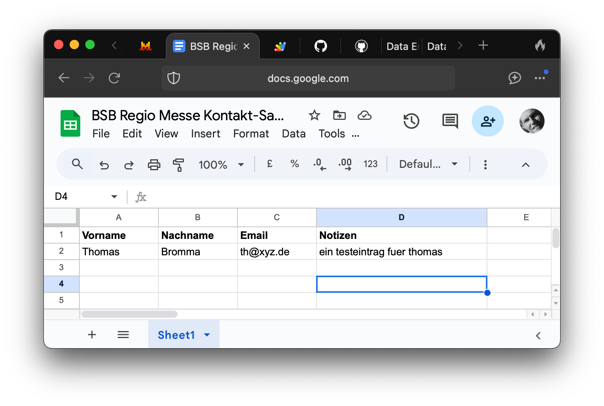

# bsbkontakt

[BSB Regio Messe Kontakt-Sammlung HTML](https://jeremytammik.github.io/bsbkontakt/)

## Motivation

Ein Punkt in deiner Mail hat mein Interesse geweckt:

- Kontakt-Sammlung: wir benötigen ein Formblatt, um Adressen und Themen von Interessenten zu erfassen

Ich bin anderer meinung.
Anstatt sie haendisch auf zetteln zu erfassen, kritzeln, nachher muehsam verwalten, entziffern, abschreiben, uebertragen und korrigieren, koennte man sie digital erfassen.

## Development

### Initial Test Implementation

Ich habe eine kleine app programmiert, die in jedem browser laeuft, also auf jedem mobiltelefon und auf jedem PC.

Sie ermoeglicht im moment die eingabe von:

- Vorname
- Nachname
- Emailanschrift
- Notizen

Diese liste kann natuerlich bei bedarf angepasst werden. Die eingegebenen daten werden dann per knopfdruck in eine google docs tabelle uebertragen.

Die webseite sieht so aus:

Hier ist die entstehende tabelle:

Hier ist die URL der app, die du gerade sofort testen kannst:

- https://jeremytammik.github.io/bsbkontakt/

ich bin leider kein sicherheitsexperte. Man kann irgendwie den zugriff auf die tabelle einschraenken, und das muss man wohl auch machen, wenn man den datenschutz wahren moechte, was man ja auch muss.

Ich hatte freude das hier zu machen.

Mein erster versuch jemals! Noch nie vorher habe so etwas ausprobiert. Das habe ich der KI zu verdanken, die mich dabei geholfen hat. Ich benutze seit gestern Mistral le Chat:

- https://chat.mistral.ai/chat

Hier ist das protokoll meiner anfrage und entwicklung dieser applikation, falls jemand interesse haben sollte, zu sehen, wie sowas ablaufen koennte:

- https://chat.mistral.ai/chat/7d0f57f6-a7ef-49a2-92ef-376813790e10

<!---

Hier ist die URL der tabelle, in dem die daten eingetragen werden:

- https://docs.google.com/spreadsheets/d/1vLdfyc12y5USJhDrvCgOHMUmgd2AC4uulljYeVQkxyA/edit?gid=0#gid=0

URLs:

- [Script URL](https://script.google.com/macros/s/AKfycbxYI49XOSyBZjMvnzBg5sSupedelS_9EQ08HiXwr9skWS4Xnk7IYyxLAID08j5bbyO8XQ/exec)

script url version
3: https://script.google.com/macros/s/AKfycbzs2Gv-5b9fa8YwszxKnRgiK-pbJ2Up3c8b8CVZdbueEbKK6AGxMTESuT-ka47GO9EMIw/exec
4: https://script.google.com/macros/s/AKfycby0mojSNK9Frnzn9ImbBkrkhmCx6Vnm55gEAB_IGgOpo9wfrBkNaYw3ojENSrEa-_iXow/exec
5: https://script.google.com/macros/s/AKfycbwEnFNQG8IbA-al21kMz2vgt8DnA_a_09P_-gfj2thpM6XDdI-ItsPLbnZIBRb_koVV3g/exec

-->

### Additional Requirements

Wenn Du mit einer App die Interessenten-Daten vollständig erfassen möchtest, dann brauchst Du mindestens 4 Menus.
Das Menu 2 kann sehr eng werden...

Auf Papier sollte man eine Unterschrift verlangen, in der App würde ein Häkchen zur Zustimmung und Kenntnisnahme unserer Rahmenbedingungen durch den Interessenten genügen.

Die von Dir angesprochene Datensicherheit ist etwas, das wir selbst bestimmen und steuern können.
Zugriff braucht jeder, der Standdienst hat und die App auf seinem Smart Phone aufruft, um die Interessenten-Daten zu erfassen.

Die Ablage in der Cloud ist bestimmt auch sicher &ndash; davon sollte man ausgehen, wenn Google diesen Service anbietet.

Das Schreiben in die Cloud und das Exportieren in eine Excel-Datei ist wohl am meisten zugriffsgefährdet.
Die Datenübertragung muss über das Smart Phone Netz erfolgen und nicht z.B. über ein offenes WLAN.

## Author

Jeremy Tammik,
[The Building Coder](http://thebuildingcoder.typepad.com),
[ADN](http://www.autodesk.com/adn)
[Open](http://www.autodesk.com/adnopen),
[Autodesk Inc.](http://www.autodesk.com)

## License

This sample is licensed under the terms of the [MIT License](http://opensource.org/licenses/MIT).
Please see the [LICENSE](LICENSE) file for full details.

