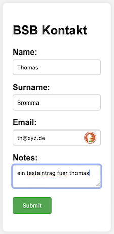

# bsbkontakt

BSB Regio Messe Kontakt-Sammlung HTML

## Motivation and Development

Ein Punkt in deiner Mail hat mein Interesse geweckt:

- Kontakt-Sammlung: wir benötigen ein Formblatt, um Adressen und Themen von Interessenten zu erfassen

Ich bin anderer meinung.
Der punkt hat mich animiert, eine neue kleine app zu implementieren, um die kontaktdaten zu sammeln, anstatt sie haendisch auf zetteln zu kritzeln, die nachher muehsam verwaltet, entziffert, abgeschrieben, uebertragen und korrigiert werden muessen.

Ich habe eine kleine app programmiert, die in jedem browser laeuft, also auf jedem mobiltelefon und auf jedem PC.

Sie ermoeglicht im moment die eingabe von:

- Vorname
- Nachname
- Emailanschrift
- Notizen

Diese liste kann natuerlich bei bedarf angepasst werden. Die eingegebenen daten werden dann per knopfdruck in eine google docs tabelle uebertragen.

Die webseite sieht so aus:

Hier ist die entstehende tabelle:

Hier ist die URL der app, die du gerade sofort testen kannst:

- https://jeremytammik.github.io/bsbkontakt/

Hier ist die URL der tabelle, in dem die daten eingetragen werden:

- https://docs.google.com/spreadsheets/d/1vLdfyc12y5USJhDrvCgOHMUmgd2AC4uulljYeVQkxyA/edit?gid=0#gid=0

ich bin leider kein sicherheitsexperte. Man kann irgendwie den zugriff auf die tabelle einschraenken, und das muss man wohl auch machen, wenn man den datenschutz wahren moechte, was man ja auch muss.

Ich hatte freude das hier zu machen.

Mein erster versuch jemals! Noch nie vorher habe so etwas ausprobiert. Das habe ich der KI zu verdanken, die mich dabei geholfen hat. Ich benutze seit gestern Mistral le Chat:

- https://chat.mistral.ai/chat

Hier ist das protokoll meiner anfrage und entwicklung dieser applikation, falls jemand interesse haben sollte, zu sehen, wie sowas ablaufen koennte:

- https://chat.mistral.ai/chat/7d0f57f6-a7ef-49a2-92ef-376813790e10

## Author

Jeremy Tammik,
[The Building Coder](http://thebuildingcoder.typepad.com),
[ADN](http://www.autodesk.com/adn)
[Open](http://www.autodesk.com/adnopen),
[Autodesk Inc.](http://www.autodesk.com)

## License

This sample is licensed under the terms of the [MIT License](http://opensource.org/licenses/MIT).
Please see the [LICENSE](LICENSE) file for full details.
